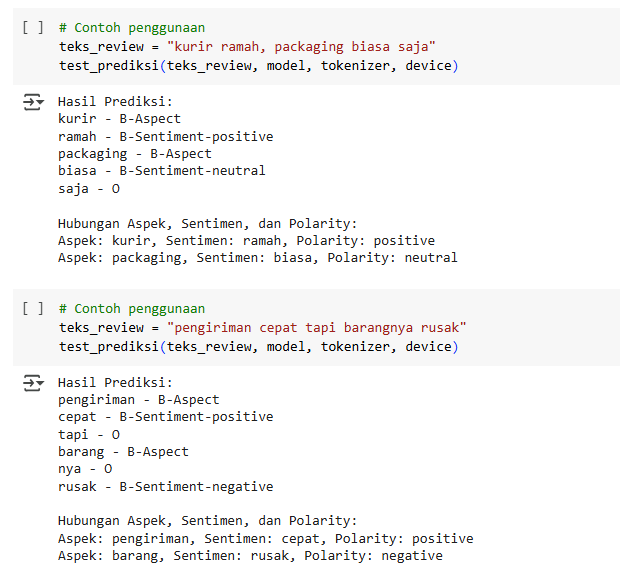

# Project Pengantar Text Mining "Sequential Labelling For Sentiment Extraction in Tokopedia's Customer Review with IndoBERT"  

Kelompok 3  
Nama Anggota :  
1. Dionisius Indra Raditya (M0721019)  
2. Erin Jihan Wahyu Kusuma (M0721024)  
3. Muhammad Rifai (M0721047)  
4. Pramesthi Kartika Siwi Hapsari (M0721058)  
5. Siti A'isyah (M0721064)  

📌 Deskripsi Project  
Merupakan project untuk mata kuliah Pengantar Text Mining. Project ini berisi tentang pembuatan sintaks model sequential labelling untuk ekstraksi emosi dari ulasan pengguna tokopedia. Dataset berasal dari website kaggle https://www.kaggle.com/datasets/jocelyndumlao/prdect-id-indonesian-emotion-classification/data. Project ini dikerjakan secara bersama sama dalam Google Colaboratory. Tujuan dari project ini adalah membuat model sequential labelling yang dilatih dari ulasan pengguna agar dapat memprediksi apakah ulasan tersebut memiliki sentimen positif, negatif atau netral. Project ini lebih berfokus pada model yang bekerja untuk ekstraksi sentimen pada kata atau kalimat baru.   

📌 Main Feature  
1. Pemodelan BIO (Begin-Inside-Out)  
2. Ekstraks Triplet Aspect-Sentiment-Polarity  

📌 Preview Output Model  

